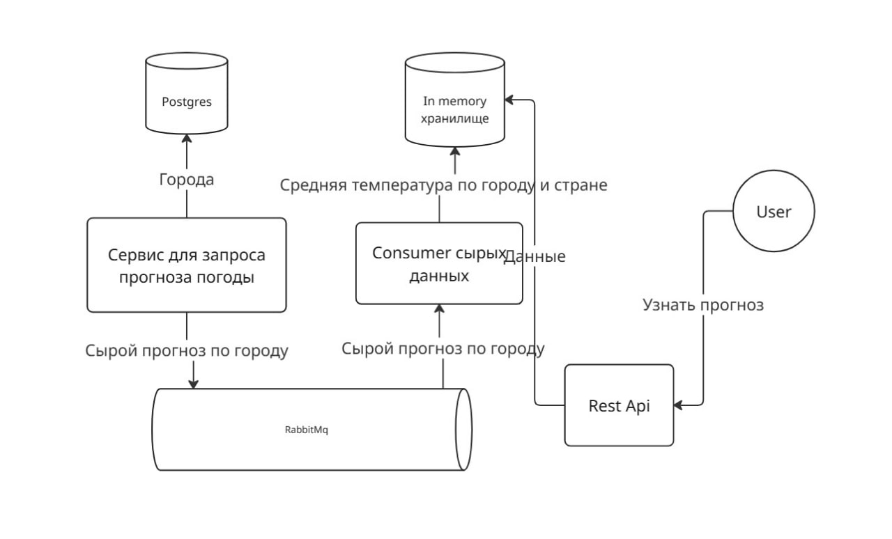

# Read Me First

The following was discovered as part of building this project:

* The original package name 'dev.kruchkovenko.weather report' is invalid and this project uses '
  dev.kruchkovenko.weather.report' instead.
# Конфигурация проекта

## Настройка городов
Для настройки городов, по которым будет получиться прогноз погоды в файле docker-compose.yml <br/>
Для сервиса producer задайте переменную ```COUNTRIES_LIST``` к примеру ```Moscow,RU;Berlin,DE;Paris,FR``` <br/>
## Настройка частоты обращения к сервисам прогноза погоды

Для настройки частоты обращения,в файле docker-compose.yml <br/>
Для сервиса producer задайте переменную ```SERVER_INTERVAL_SECONDS``` к примеру ```300``` <br/>
Данная переменная показывает как часто будет происходить запрос к апи сервисам в секундах<br/>
то есть ли вы напишите 5, то запрос будет отравляться каждые 5 секунд. <br/>
# Как запустить проект

## Требования

Наличие на устройстве docker-compose

## Запуск

Соберите контейнер ```docker-compose build``` <br/>
Запустите контейнер ```docker-compose up```

# Схема приложения


